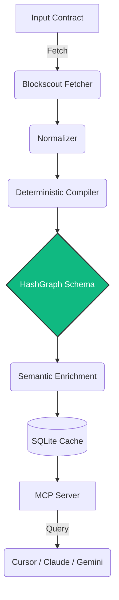

# HashGraph

**Deterministic by design. Explainable by AI.**

Compiles HashKey Chain smart contracts into structured **Protocol Graphs** that Cursor, Claude, and other AI agents can query instantly through MCP.

[](https://www.npmjs.com/package/hashgraph-mcp)
[](./LICENSE)
[](https://modelcontextprotocol.io)
[](https://hsk.blockscout.com)

| | |
|---|---|
| **Live site** | https://hashgraph-eight.vercel.app |
| **Explorer** | https://hashgraph-eight.vercel.app/explorer.html |
| **Docs** | https://hashgraph-eight.vercel.app/docs.html |
| **npm** | `hashgraph-mcp@1.0.4` · https://www.npmjs.com/package/hashgraph-mcp |
| **GitHub** | https://github.com/Nifemi0/HashGraph |

---

## The problem → the product

**Today**

`Explorer` → `ABI` → `Read Solidity` → `Guess architecture` → `Integrate`

**With HashGraph**

`Explorer` → `Compile` → `Protocol Graph` → `Ask AI` → `Ship`

LLMs can read code. They still don’t understand *protocols* — roles, privileged functions, events, and dependencies across a contract surface. HashGraph **deterministically compiles** verified on-chain artifacts into a reusable graph, then optionally annotates it with AI. Structural facts never come from the model.

> **ADR-015 — AI never creates facts.** Every role, event, and privileged function is extracted from verified ABI/source. The semantic layer only explains what the compiler already proved.

---

## Try it in 30 seconds

```bash
npx -y hashgraph-mcp
```

### Wire into Claude Desktop

Add to `claude_desktop_config.json`:

```json
{
  "mcpServers": {
    "hashgraph": {
      "command": "npx",
      "args": ["-y", "hashgraph-mcp"]
    }
  }
}
```

### Wire into Cursor

**Settings → Features → MCP → Add new MCP server**

- Name: `HashGraph`
- Type: `command`
- Command: `npx -y hashgraph-mcp`

Restart the client, then paste a demo prompt below.

No clone required for the MCP path.

---

## Live demo (HashKey Mainnet)

Verified contracts you can compile right now:

| Chip | Address | Why it’s a good demo |
|------|---------|----------------------|
| **CELA** (hero) | `0xF1B50eD67A9e2CC94Ad3c477779E2d4cBfFf9029` | Mint/burn privileged · transfer public |
| **WHSK** | `0xB210D2120d57b758EE163cFfb43e73728c471Cf1` | Wrapped HSK |
| **DOGS** | `0xF9fB2302DA48d5715b10921CEC3b82c99ACb39AC` | Simple ERC-20 |

Or open the [web explorer](https://hashgraph-eight.vercel.app/explorer.html) and click a chip.

### Copy-paste prompts

**1. Protocol graph**

```text
Using HashGraph MCP, get the protocol graph for
0xF1B50eD67A9e2CC94Ad3c477779E2d4cBfFf9029.
Highlight roles, events, privileged functions, dependencies, and integrity.
```

**2. Lightweight summary**

```text
Give me a contract summary for that address — intent, roles, privileged functions only.
```

**3. Transaction safety (calldata → meaning)**

```text
Explain this calldata against the same contract:
0xa9059cbb0000000000000000000000001111111111111111111111111111111111111111000000000000000000000000000000000000000000000000000000000000000a
What function is it, what are the args, and is it privileged or public?
```

**4. Search**

```text
Search the protocol for "transfer" and "mint".
```

---

## MCP tools (9)

| # | Tool | Parameters | Description |
|---|------|------------|-------------|
| 1 | `get_protocol_graph` | `address` | Full structural + semantic protocol graph |
| 2 | `get_contract_summary` | `address` | Lightweight overview for agents/wallets |
| 3 | `explain_transaction` | `address`, `calldata` | Decode calldata + privilege classification |
| 4 | `search_protocol` | `address`, `query` | Search roles / events / privileged functions |
| 5 | `simulate_transaction` | `to`, `data`, `from?`, `value?` | Dry-run against HashKey Mainnet state |
| 6 | `read_contract` | `address`, `data` | Call view/pure functions |
| 7 | `get_source_code` | `address` | Resolved verified Solidity source |
| 8 | `lookup_graph_attestation` | `address` | On-chain graph attestation lookup (testnet registry) |
| 9 | `register_protocol_graph` | `address`, `graphHash`, `metadataURI` | Register graph hash (**writes gated** by default) |

Write path (`register_protocol_graph`) requires `HASHGRAPH_ENABLE_WRITES=true` plus a funded key. Safe default: read-only.

---

## Architecture



### Compiler pipeline

1. **RoleExtractor** — AccessControl, Ownable, custom auth roles  
2. **EventExtractor** — state-emission events  
3. **FunctionExtractor** — public mutators + privileged functions  
4. **DependencyExtractor** — external interfaces / downstream contracts  

### Stack

| Layer | Tech |
|-------|------|
| Chain | HashKey Mainnet (177) · Blockscout |
| Runtime | Node.js · TypeScript · viem |
| Cache | SQLite |
| Interface | MCP (`@modelcontextprotocol/sdk`) · npm SDK |
| Optional AI | OpenAI / Anthropic / DeepSeek (annotates only) |
| Registry | On-chain attestations (HashKey Testnet) |

---

## FAQ (for judges)

**Why not just ask Claude?**  
Claude reads files. HashGraph compiles *protocols* into a deterministic graph with provenance and a reusable schema any MCP client can query.

**Why is this deterministic?**  
Structural facts come only from verified blockchain artifacts (ABI, source, events, roles, dependencies). AI annotates; it cannot invent.

**Why MCP?**  
Agents already speak MCP. One server → Cursor, Claude Desktop, and any compatible client — no custom plugin per IDE.

**Why HashKey?**  
Better tooling lowers integration friction. HashGraph makes HashKey protocols legible to both humans and AI coding agents, which speeds ecosystem adoption.

**Is it read-only?**  
Yes by default. Simulation and reads hit mainnet state without writing. Registry registration is explicitly gated.

---

## Programmatic SDK

```bash
npm install hashgraph-mcp
```

```ts
import { HashGraphClient } from "hashgraph-mcp";

const client = new HashGraphClient();
const graph = await client.getProtocolGraph(
  "0xF1B50eD67A9e2CC94Ad3c477779E2d4cBfFf9029"
);

console.log(graph.structural.events);
console.log(graph.security.privileged_functions);
```

See [SDK.md](./SDK.md) for the full API.

---

## Local development

```bash
git clone https://github.com/Nifemi0/HashGraph.git
cd HashGraph
npm install
npm run build

npm run mcp          # MCP server (stdio)
npm run dashboard    # local dashboard
npm test             # test suite
npm run seed         # warm demo cache (HashKey contracts)
npm run demo:smoke   # smoke all MCP tool surfaces
```

Optional env (see `.env` locally — never commit secrets):

| Variable | Purpose |
|----------|---------|
| `HASHKEY_RPC_URL` | Mainnet RPC (default `https://mainnet.hsk.xyz`) |
| `LLM_PROVIDER` / `*_API_KEY` | Semantic enrichment (optional) |
| `REGISTRY_ADDRESS` | Attestation registry (testnet) |
| `HASHGRAPH_ENABLE_WRITES` | Unlock `register_protocol_graph` |

---

## CI / CD & versioning

- **Push / PR:** type-check → test → audit → build  
- **Release tag:** publish to npm  
- **Current:** `v1.0.4` — [docs/VERSION_HISTORY.md](./docs/VERSION_HISTORY.md)

---

## License

MIT · Built for **HashKey Chain**
