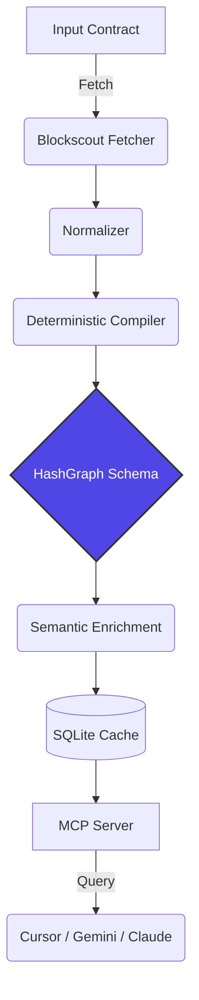

# HashGraph

**Deterministic by design. Explainable by AI.**

HashGraph compiles deterministic blockchain artifacts into an AI-readable Protocol Graph that IDEs, wallets, AI agents, and developer tools can consume through MCP.

## Why HashGraph?

**Current Workflow**
`Explorer` → `ABI` → `Read Solidity` → `Guess Architecture` → `Integrate`

**HashGraph Workflow**
`Explorer` → `Compile` → `Protocol Graph` → `Ask AI` → `Ship`

## The Problem
LLMs understand code, but they don't understand protocols. A protocol is an emergent property of multiple smart contracts, roles, permissions, and events. AI agents (like Cursor or Claude) struggle to build a holistic mental model from raw ABIs. HashGraph solves this by deterministically compiling contracts into a structured Protocol Graph, and then using a Semantic Layer to explain it.

---

## Installation

```bash
# Clone the repository
git clone https://github.com/Nifemi0/HashGraph.git
cd HashGraph

# Install dependencies
npm install

# Build the project
npm run build
```

## Architecture



## Compiler Pipeline

1. **RoleExtractor**: Extracts AccessControl, Ownable, and custom auth roles.
2. **EventExtractor**: Extracts state-emission events.
3. **FunctionExtractor**: Extracts public mutators and privileged functions.
4. **DependencyExtractor**: Resolves external interfaces and downstream contracts.

## Semantic Pipeline (AI Enrichment)

Adhering to **ADR-015 (AI Never Creates Facts)**, the AI engine consumes the deterministic structural facts and extracts:
- Technical Intent
- User Goals
- Security Guardrails
- Developer Integration Notes
*All AI outputs undergo strict Citation Validation against the deterministic graph.*

## MCP Server Usage

HashGraph is primarily consumed as a Model Context Protocol (MCP) server. No repository clone is required to use it.

### Quick Start: Use HashGraph in Cursor / Claude Desktop

Add this configuration to your AI client to enable HashGraph globally:

#### For Claude Desktop
Add this to your `claude_desktop_config.json` (located at `~/Library/Application Support/Claude/claude_desktop_config.json` on macOS or `%APPDATA%/Claude/claude_desktop_config.json` on Windows):
```json
{
  "mcpServers": {
    "hashgraph": {
      "command": "npx",
      "args": ["-y", "hashgraph-mcp"]
    }
  }
}
```

#### For Cursor
1. Open Cursor Settings.
2. Navigate to **Features > MCP**.
3. Click **+ Add new MCP server**.
4. Set Name: `HashGraph`
5. Set Type: `command`
6. Set Command: `npx -y hashgraph-mcp`

---

## What to Ask Claude/Cursor After Adding MCP

Once integrated, restart your AI client, open a chat, and ask questions like:
* *"Analyze HashKey Chain contract 0xF1B50eD67A9e2CC94Ad3c477779E2d4cBfFf9029."*
* *"Return the protocol graph, privileged functions, events, dependencies, and integration notes for CELA."*
* *"Explain what this transaction calldata does using the HashGraph MCP server: 0xa9059cbb..."*

---

## Available MCP Tools

HashGraph exposes the following tools directly to your AI client:
- `get_protocol_graph(address)`: Compiles a smart contract into a structured JSON graph containing roles, dependencies, events, and intent.
- `get_contract_summary(address)`: Returns a lightweight structural and metadata overview of a contract.
- `explain_transaction(address, calldata)`: Decodes raw transaction calldata and evaluates safety.
- `search_protocol(address, query)`: Searches the cached protocol graphs for privileges, standard interfaces, or variables.
- `simulate_transaction(to, data, from, value)`: Simulates a transaction against the blockchain to see its outcome.
- `read_contract(address, data)`: Reads state variables or view functions directly.
- `get_source_code(address)`: Fetches fully resolved, unflattened Solidity source code for verified contracts.
- `lookup_graph_attestation(address)`: Checks the on-chain HashKey Mainnet attestation registry.
- `register_protocol_graph(address)`: Registers a deterministic protocol graph hash (gated by default).

---

## Local Development & Compilation

If you want to run or build the project from source:

```bash
# Start the MCP server locally in stdio transport mode
npm run mcp

# Run the local test suite
npm test

# Build the MCP server bundle
npm run build
```

## Dashboard & Visualization
Launch the HashGraph web dashboard to visually compile contracts in real-time.
```bash
npm run dashboard
```

---

## FAQ (For Judges)

**"Why not just ask Claude?"**
> Claude can read individual contracts. HashGraph compiles entire protocols into a deterministic graph with provenance, explainability, and a reusable schema exposed through MCP.

**"Why is this deterministic?"**
> Every structural fact comes from verified blockchain artifacts—ABI, verified source, events, roles, and dependencies. The AI layer only annotates those facts and cannot create new ones.

**"Why MCP?"**
> Because AI tools already speak MCP. Once HashGraph exposes a protocol through MCP, Cursor, Claude Desktop, and other compatible tools can query it without custom integrations.

**"Why HashKey?"**
> Better developer tooling reduces integration friction. HashGraph makes HashKey protocols easier for both developers and AI coding agents to understand, which can accelerate ecosystem adoption.


## License
MIT License
